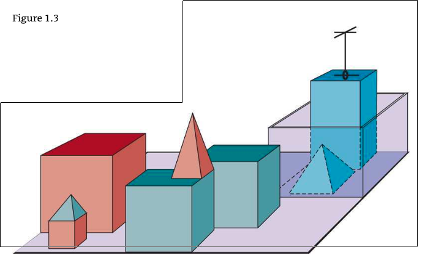
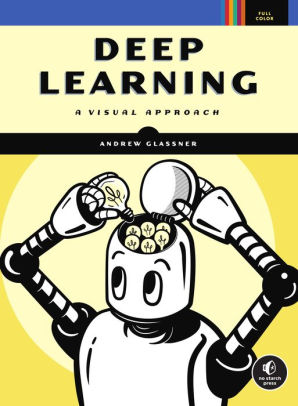
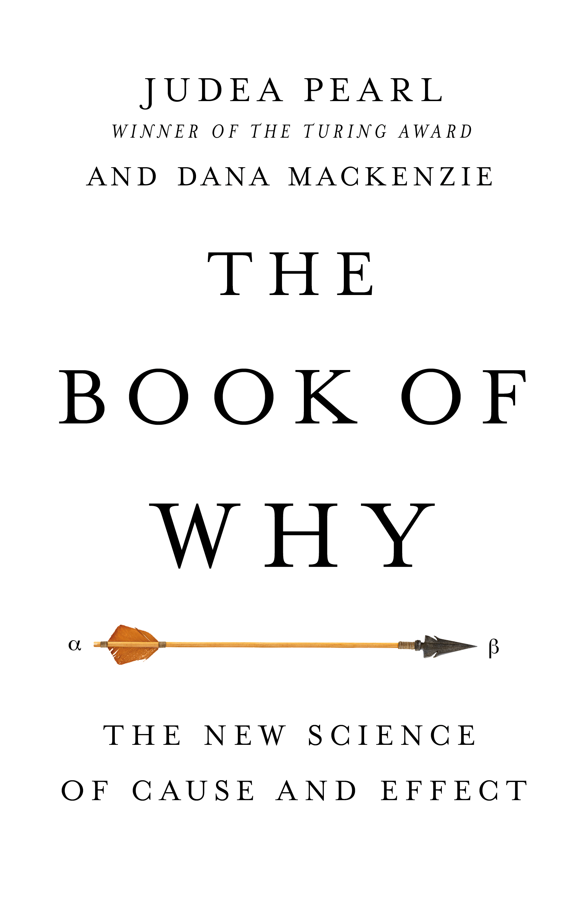
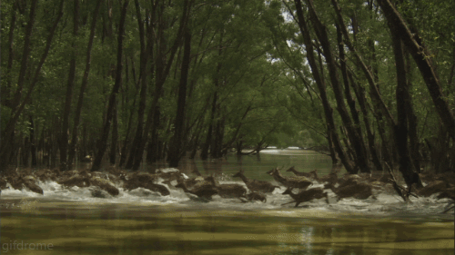

# Table of Contents

-   [What're you going to learn today?](#org89fbcf4)
-   [Who am I?](#orgd3a6939)
    -   [Science](#org5f8bcd5)
    -   [Industry](#org6f90b53)
    -   [Teaching](#orgefdae08)
    -   [Pleasure](#org2079db2)
-   [What are your expectations?](#org8f4fb43)
-   [Which topics will we cover?](#org1d3a33c)
    -   [Modern approach to AI](#orgd86e66b)
    -   [What is AI?](#org67e13f5)
    -   [History of AI](#org53014f1)
    -   [State of the Art of AI](#org6d9aa63)
    -   [Risks and benefits of AI](#orgd55b87c)
    -   [Agile management](#org40f583a)
    -   [Causation](#orged92cdf)
    -   [Schedule (see Syllabus)](#org014cac1)
-   [How will we do it?](#org2b1ccb1)
    -   [Classroom sessions](#orgb55b7d6)
    -   [Lecture scripts with exercises (GitHub)](#org8f0cfbf)
    -   [Your presentations](#orgaf6e5c5)
    -   [Your protocols](#org0a3afaf)
    -   [Stuff you bring to class](#orgc9d1a52)
-   [What do you have to do to pass?](#org2b8bbde)
    -   [AIMA presentation (> 50%)](#org45cf3ce)
    -   [Session protocol (> 50%)](#org7b5dfbe)
    -   [Weekly participation (> 50%)](#orge83fd2b)
    -   [Final AI application (> 50%)](#orgb9ad774)
        -   [What constitutes an application?](#org7fb0eec)
        -   [Do you have examples for applications?](#org03ac32e)
        -   [Can I design an application?](#org5715a84)
-   [What's next?](#orge9db7bb)
    -   [In the course](#orge4a015b)
    -   [Your challenges](#org32cfb01)
-   [Any questions?](#orgfe43841)

# What're you going to learn today?

-   Who is your lecturer?
-   Who are you and what do you want?
-   Which topics will we cover?
-   How will we do it?
-   What do you have to do to pass?
-   What's next?

# Who am I?

## Science

-   Development of WWW
-   PhD theoretical particle physics
-   60 research publications
-   Assoc. Ed. Int. J. of Data Science
-   Ed. Board Int. J. of Big Data Mgmt.
-   Scientific member [d-cube@Berlin](https://www.hwr-berlin.de/en/research/research-centres-and-institutes/)

## Industry

-   Executive at Accenture & Shell
-   Coach and consultant
-   Certified psychotherapist
-   Startup mentor

## Teaching

-   Business informatics [@HWR Berlin](https://www.hwr-berlin.de/en/)
-   Visiting professor of data science @Lyon
-   Adviser for [CPU @LA](https://catholicpolytechnic.org/)
-   Internship supervision

## Pleasure

-   Playing: [Assassin's Creed Valhalla](https://en.wikipedia.org/wiki/Assassin%27s_Creed_Valhalla) (2020)
-   Reading: [Waugh, Sword of Honour](https://en.wikipedia.org/wiki/Sword_of_Honour) (1952-1961)
-   Watching: [The Middle](https://en.wikipedia.org/wiki/The_Middle_(TV_series)) (2009-2018)

# [What are your expectations?](https://ideaboardz.com/for/AI%20seminar%20expectations/4049030)

-   What do you want to learn here?
-   What would you like to avoid?
-   What did you take away from another course?
-   What did you really not like in another course?

# Which topics will we cover?

## Modern approach to AI

Source: [AIMA, 10th ed.](http://aima.cs.berkeley.edu/) (2021)

## What is AI?

## History of AI

## State of the Art of AI

## Risks and benefits of AI

Source: [qulix.com](https://www.qulix.com/about/benefits-and-risks-of-ai/) (22 May 2020)

## Agile management

Image: [Scrum](https://scrum.org) burndown chart

## Causation

## Schedule (see [Syllabus](https://github.com/birkenkrahe/ai482/blob/main/syllabus.md))

Image: [Princeton U.](https://www.princeton.edu/news/2018/12/03/life-unpacked-freshman-seminar-explores-search-meaningful-life)

# How will we do it?

## Classroom sessions

## Lecture scripts with exercises ([GitHub](https://github.com/birkenkrahe/ai482))

## Your presentations

## Your protocols

-   Image: Unsplash ([@Ryan Arnst](https://unsplash.com/photos/jAQKshrauDQ))

## Stuff you bring to class

-   Image: Unsplash ([@Evan Demicoli](https://unsplash.com/photos/HGCqL-tRcac))

# TODO What do you have to do to pass?

## AIMA presentation (> 50%)

## Session protocol (> 50%)

-   Image: Unsplash ([@Ryan Arnst](https://unsplash.com/photos/jAQKshrauDQ))

## Weekly participation (> 50%)

## Final AI application (> 50%)

Source: Unsplash ([@Minh Pham](https://unsplash.com/photos/HI6gy-p-WBI))

### What constitutes an application?

-   IMRaD structure ([video](https://youtu.be/dip7UwZ3wUM))
-   Problem to be solved
-   Literature review
-   Methodology
-   Results / Idea / Business model
-   Discussion with limitations
-   References

### Do you have examples for applications?

-   Chapters in AIMA
-   (Parts of) Research papers
-   Scientific or industry blogs

### Can I design an application?

-   Keep It Simply Scientific (IMRaD)
-   Read and take notes (see [FAQ](https://github.com/birkenkrahe/org/blob/master/FAQ.md))
-   Researchers are beginners
-   Designers are creators

# What's next?

## In the course

-   Lecture "What is AI?"
-   Lab discussion and questions
-   Come up with application ideas
-   Schedule protocol and presentation

## Your challenges

<table border="2" cellspacing="0" cellpadding="6" rules="groups" frame="hsides">

<colgroup>
<col  class="org-left" />

<col  class="org-left" />
</colgroup>
<thead>
<tr>
<th scope="col" class="org-left">What?</th>
<th scope="col" class="org-left">When?</th>
</tr>
</thead>

<tbody>
<tr>
<td class="org-left">Get AIMA</td>
<td class="org-left">ASAP</td>
</tr>

<tr>
<td class="org-left">Schedule protocol/presentation</td>
<td class="org-left">Aug 30</td>
</tr>

<tr>
<td class="org-left">1st sprint review</td>
<td class="org-left">Sep 10</td>
</tr>

<tr>
<td class="org-left">Check FAQs x 2 in GitHub</td>
<td class="org-left">n.d.</td>
</tr>
</tbody>
</table>

n  | Ask questions (class/GitHub)   | n.d.   |

*\*) do this every week until December*

# Any questions?

[This presentation is available online.](https://github.com/birkenkrahe/ai482/tree/main/1_overview)

