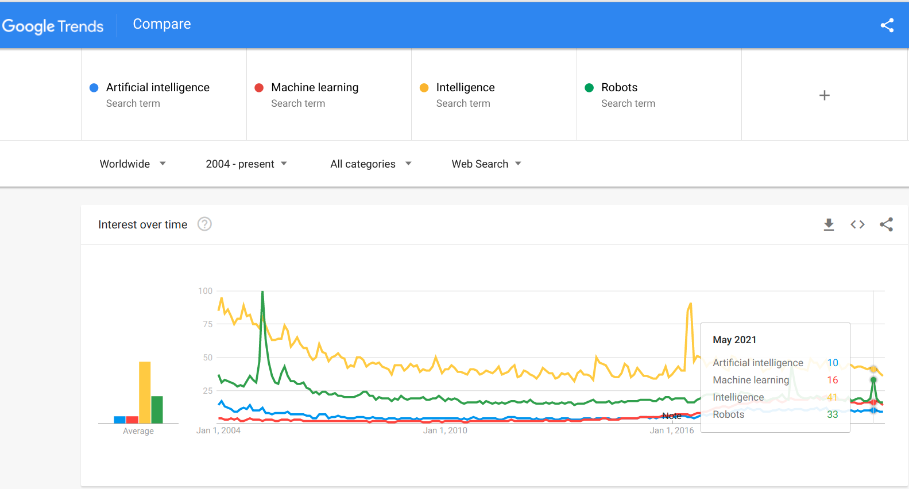

# Table of Contents

1.  [What're you going to learn?](#org2f12318)
2.  [What is intelligence?](#org7696105)
    1.  [Search patterns](#orge8825bf)
    2.  [Group work](#org8b798f0)
3.  [Different approaches to AI](#org8c3f12c)
    1.  [Fields of inquiry](#org2fff310)
    2.  [Dimensions of inquiry](#orgf987fcd)
    3.  [Four approaches](#org5cb84a5)
        1.  [Acting humanly ("Turing test" approach)](#orgf9d911f)
        2.  [Thinking humanly ("cognitive modeling" approach)](#org893af96)
        3.  [Thinking rationally ("laws of thought" approach)](#org5761ac7)
        4.  [Acting rationally ("rational agent" approach)](#org8473b75)
4.  [Major issues](#orgd8d8d99)
    1.  [Bounded rationality](#orgaf7dc3c)
    2.  [Value alignment](#org9f4bd25)
5.  [What's next?](#orgee546fe)
6.  [Any questions?](#org2a0611f)
7.  [References](#org48968dd)

# What're you going to learn?

-   What is intelligence?
-   Different approaches to AI
-   The standard model of AI
-   Bounded rationality
-   The Value alignment problem
-   What's next?

# What is intelligence?

## Search patterns

## Group work

-   Get together in groups of 2-3
-   Define INTELLIGENCE (5')
-   Define ARTIFICIAL INTELLIGENCE (5')
-   Briefly present your results (10')

# Different approaches to AI

Which fields of inquiry (= disciplines) to use?

## Fields of inquiry

-   Language
-   Philosophy
-   Science
-   History

## Dimensions of inquiry

-   Should we focus on humans?
-   Should we focus on machines?

## Four approaches

<table border="2" cellspacing="0" cellpadding="6" rules="groups" frame="hsides">

<colgroup>
<col  class="org-left" />

<col  class="org-left" />

<col  class="org-left" />
</colgroup>
<thead>
<tr>
<th scope="col" class="org-left">&#xa0;</th>
<th scope="col" class="org-left">THOUGHT / LOGIC</th>
<th scope="col" class="org-left">BEHAVIOR / ACTION</th>
</tr>
</thead>

<tbody>
<tr>
<td class="org-left">**HUMANITY**</td>
<td class="org-left">*Cognitive modeling*</td>
<td class="org-left">*Turing Test*</td>
</tr>

<tr>
<td class="org-left">**RATIONALITY**</td>
<td class="org-left">*Laws of Thought*</td>
<td class="org-left">*Rational Agents*</td>
</tr>
</tbody>
</table>

### Acting humanly ("Turing test" approach)

-   Natural language processing
-   Knowledge representation
-   Automated reasoning
-   Machine learning
-   Computer vision
-   Robotics

### Thinking humanly ("cognitive modeling" approach)

-   Introspection
-   Psychological experiments
-   Brain imaging
-   Cognitive science
-   Algorithms

### Thinking rationally ("laws of thought" approach)

-   Syllogistic reasoning
-   Logic
-   Expert systems
-   Uncertainty
-   Probability

### Acting rationally ("rational agent" approach)

-   Combination approach
-   Constructivist
-   Doing the right thing
-   Standard model
-   Control theory

# Major issues

-   Bounded Rationality
-   Value alignment problem

## Bounded rationality

Image: [Bakopoulos, 1985](#org277196c)

## Value alignment

Image: [The Mechanical Turk](https://www.amazon.com/Turk-Famous-Eighteenth-Century-Chess-Playing-Machine/dp/B000HWZ28Q)

# What's next?

-   Scientific foundations of AI

# Any questions?

[This presentation is available online.](https://github.com/birkenkrahe/ai482/tree/main/2_what_is_ai)

# References

 Bakopoulos, J. Yannis, "Toward a More Precise
Concept of Information Technology" (1985). ICIS 1985 Proceedings. 4.
<http://aisel.aisnet.org/icis1985/4>

